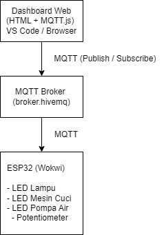
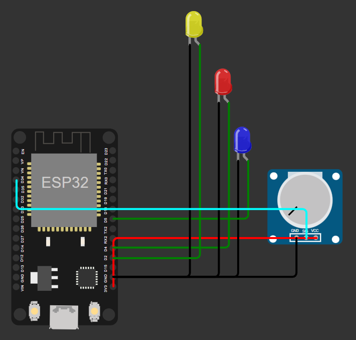
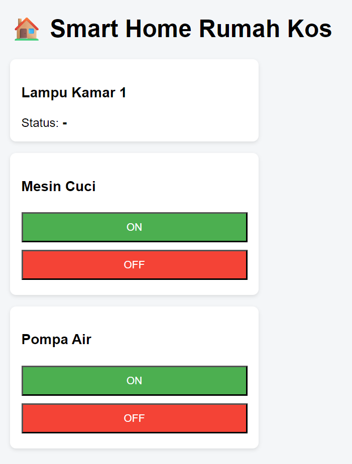

# Smart Home IoT Rumah Kos Berbasis MQTT

## Deskripsi Proyek
Proyek ini merupakan implementasi sistem **Smart Home berbasis Internet of Things (IoT)** untuk monitoring dan pengendalian perangkat listrik pada rumah kos. Sistem dirancang untuk mensimulasikan pengelolaan beberapa perangkat seperti lampu kamar, mesin cuci, dan pompa air menggunakan **ESP32** yang disimulasikan melalui **Wokwi Simulator**.

Komunikasi data antara perangkat dan dashboard dilakukan menggunakan protokol **MQTT** dengan bantuan **broker publik HiveMQ**. Dashboard web dikembangkan menggunakan **HTML dan JavaScript** dan dijalankan melalui browser menggunakan Visual Studio Code.

---

## Tujuan
- Menerapkan konsep Internet of Things (IoT)
- Menggunakan protokol MQTT untuk komunikasi data
- Membangun dashboard web untuk monitoring dan kontrol perangkat
- Mensimulasikan sistem Smart Home tanpa perangkat keras fisik

---

## Arsitektur Sistem
Diagram arsitektur sistem menunjukkan hubungan antara dashboard web, MQTT broker, dan ESP32.

### Penjelasan Arsitektur:
1. **Dashboard Web**  
   Berfungsi sebagai antarmuka pengguna untuk memantau status perangkat dan mengirim perintah ON/OFF.
2. **MQTT Broker (HiveMQ)**  
   Bertindak sebagai perantara komunikasi antara dashboard dan ESP32.
3. **ESP32 (Wokwi Simulator)**  
   Mengontrol perangkat (LED sebagai simulasi) dan mengirimkan status ke broker MQTT.

---

## Diagram Wiring
Diagram wiring berikut menunjukkan koneksi antar komponen pada simulasi ESP32 di Wokwi.

### Keterangan Wiring:
- GPIO 2  → LED Kuning (Lampu Kamar)
- GPIO 4  → LED Merah (Mesin Cuci)
- GPIO 5  → LED Biru (Pompa Air)
- GPIO 34 → Potentiometer (Sensor cahaya)
- 3V3 & GND → Catu daya komponen

---

## Teknologi yang Digunakan
- **ESP32** (Simulasi Wokwi)
- **MQTT Protocol**
- **HiveMQ Public Broker**
- **HTML, CSS, JavaScript**
- **MQTT.js**
- **Visual Studio Code**

---

## Topik dan Payload MQTT
Detail topik MQTT yang digunakan dalam sistem ini dapat dilihat pada file berikut:

📁 `mqtt/topic_payload.md`

Ringkasan topik:
- `rumah_kos/kamar1/lampu/status` → Status lampu (ON / OFF)
- `rumah_kos/mesincuci/kontrol` → Kontrol mesin cuci (ON / OFF)
- `rumah_kos/pompa/kontrol` → Kontrol pompa air (ON / OFF)

---

## Dashboard Web
Dashboard web digunakan untuk:
- Menampilkan status lampu kamar
- Mengontrol mesin cuci dan pompa air secara real-time

Dashboard dibuat menggunakan **HTML dan JavaScript**, serta menggunakan library **MQTT.js** untuk terhubung ke MQTT broker melalui WebSocket.

---

## Hasil Pengujian
Pengujian sistem dilakukan dengan hasil sebagai berikut:
1. ESP32 berhasil terhubung ke MQTT Broker
2. Dashboard web berhasil menerima status perangkat dari ESP32
3. Perintah ON/OFF dari dashboard berhasil mengontrol LED pada simulasi Wokwi
4. Komunikasi data berjalan secara real-time melalui MQTT

---

## Catatan Implementasi
Karena keterbatasan perangkat keras fisik, seluruh sistem diimplementasikan menggunakan **Wokwi ESP32 Simulator**. Meskipun demikian, konsep dan mekanisme IoT, komunikasi MQTT, serta dashboard web tetap berjalan sesuai dengan implementasi nyata.

---

## Kesimpulan
Proyek ini berhasil mengimplementasikan sistem Smart Home berbasis IoT menggunakan MQTT sebagai protokol komunikasi. Sistem mampu melakukan monitoring dan kontrol perangkat secara real-time melalui dashboard web.

---

## Author
- Ramzi Akbarsya Dihariyanto (2022071040)
- Haykal Kamal Ilyasa (2022071072)
- Muhammad Kamil Idris (2022071078)

